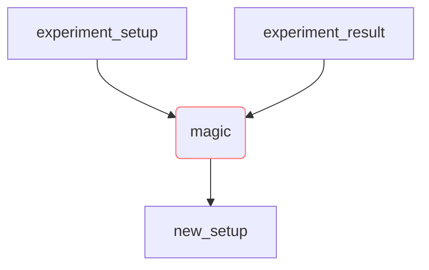

# Algorithm Title goes here

## *Note*

*The algorithms in ChemputerOptimizer should follow certain interface pattern. Experimental setup is loaded as np.array, where columns represent experimental parameters (e.g. temperature, time, volume, etc.) and rows represent experiment iterations; epxerimental results are loaded in similar manner. Constraints are not standartized, but as a starting point can go as list of tuples [(min, max)] for each experiment parameter. All mappings are done in Algorithm API class.*

## Description

Briefly describe your algorithm behaviour.

## Example

Give an example for optimization of one of test functions (see `\tests\simulations\`).

## Reference

### Publications

Place the original publication for your algorithm here (if available).

### Code

Give any references to the code implementation (e.g. papers, github repos, etc.)

## Graph

Mind that your algorithm should be iterative (i.e. **setup+result** in, *new setup* out).
If possible, submit a flowchart diagram for your algorithm, as:

